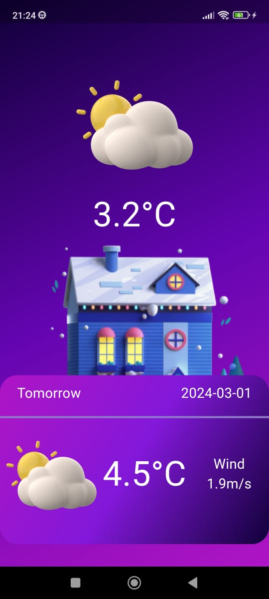

# Flutter Weather App

This Flutter Weather App is created to display weather information using the [MeteoSource](https://www.meteosource.com/) API.

## Getting Started

To run the project, follow these steps:

1. Create an account on [MeteoSource](https://www.meteosource.com/).
2. Navigate to the project directory in the terminal or command prompt and run the `flutter pub get` command.
3. Replace `YOUR_API_KEY` in the `lib/screens/home.dart` file with your own API key.
4. Run the project by executing the `flutter run` command in the terminal or command prompt.

## Screenshots

## Usage

After running the application, you can view current weather information and explore forecasts for the upcoming days.

## Contribution

If you would like to contribute to the project, please fork it and submit a pull request.

## License

This project is licensed under the [License Name] - see the [Detailed License Information].
